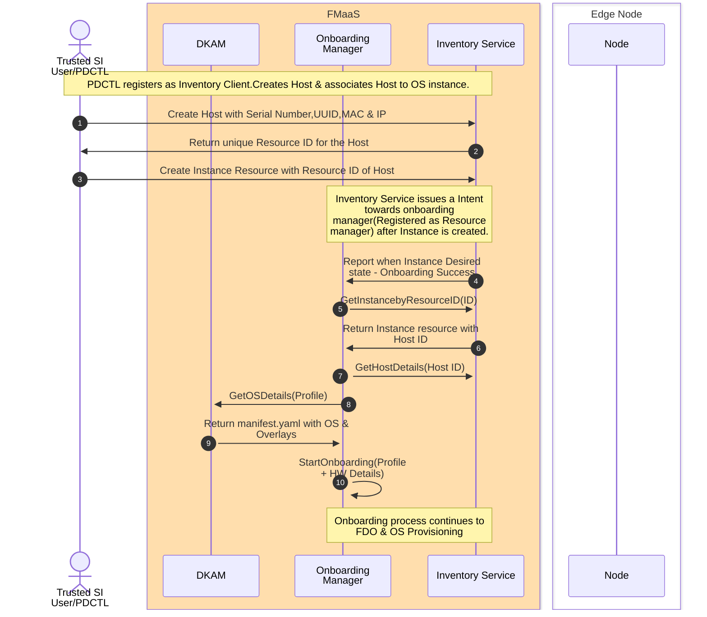

# Secure Onboarding and provisioning controller

This repo has the service controller module to do onboarding and provisioning
It will do the following things

1. OS image download as mentioned in the profile
2. FDO voucher extension
3. Tinker workflow management - DI and Final OS installation
4. Interfacing with inventory service to do profile management
5. Interfacing with DKAM service to get the curated software artifacts

## Setup

### Create Custom HTTPS supported NGINX server

1. Refer to this section [Server Certificates for HTTPS boot](https://github.com/intel-innersource/documentation.edge.one-edge.maestro/blob/762b2526abd36203f2ee5c20b45ccaea9ebb2140/content/docs/specs/secure-boot.md#server-certificates-for-htts-boot) for creating certificates. The file ```full_server.crt``` will be required in the next steps.

2. Clone the [repository](https://github.com/intel-sandbox/nginx/tree/main)

3. Go inside the repository and build and run the nginx container as per the [README](https://github.com/intel-sandbox/nginx/blob/main/README.md).
As seen in the docker run command example we are mounting two folders to the container, which are referred to in the next steps.

    ```bash
        -v ./certs:/etc/ssl/cert/ \
        -v ./data:/usr/share/nginx/html \
    ```

    ```certs``` : server certificates are present here
    ```data```  : files present here are hosted by the NGINX server

4. Once the NGINX container is up, replace the contents of ```certs/EB_web.crt``` with the contents of ```full_server.crt``` generated in the first step.

    ```bash
        cat full_server.crt > certs/EB_web.crt
    ```

### Modify auto.ipxe as per setup details

1. Inside ```data/auto.ipxe```, replace the placeholders with real values.

    ```bash
        set loadbalancer <LOADBALANCER>
        set macaddress <MAC_ADDRESS>
        set nginx <NGINX_IP_ADDRESS>
    ```

2. Copy the ```vmlinuz``` and ```initramfs``` files generated in tink-stack inside the ```data``` folder.

3. Copy the signed ```ipxe.efi``` generated as per the [documentation](https://github.com/intel-innersource/documentation.edge.one-edge.maestro/blob/762b2526abd36203f2ee5c20b45ccaea9ebb2140/content/docs/specs/secure-boot.md#download-and-build-ipxe-image) inside the ```data``` folder.

### Upload certificate to BIOS

1. Refer the [documentation](https://github.com/intel-innersource/documentation.edge.one-edge.maestro/blob/762b2526abd36203f2ee5c20b45ccaea9ebb2140/content/docs/specs/secure-boot.md#bios-settings-in-idrac-gui) to upload the HTTP boot URL.<br>
The URL will be of the form ```https://<NGINX_HOST_IP_ADDRESS/ipxe.efi```<br>
The certificate file will be the ```full_server.crt``` file generated earlier.

### HTTP Boot

1. Boot to Tinkerbell interface using HTTP boot option.

### Deploy onboarding and provisioning components

> Note: This setup instructions are meant for On-prem deployment

1. Deploy the Tinkerbell services using tink-stack umbrella helm charts. If RKE2 cluster is not setup then below setup script will bring up RKE2 cluster and deploy the Tinkerbell components.

   ```bash
   cd provisioning
   chmod +x ./setup_tinkerbell_stack_with_intel_network.sh
   ./setup_tinkerbell_stack_with_intel_network.sh
   ```

2. Build custom tinker actions docker images using script
Update config file which holds all the configuration details needed for the setup. Change parameters in config file `pub_inerface_name`, `pd_host_ip` and `load_balancer_ip` and proxy settings.

    ```bash
    cd deployments/scripts/onboarding
    vim config
    ```

    ```bash
    cd setup_scripts
    chmod + ./setup_actions.sh
    ./setup_actions.sh
    ```

3. Deploy the FDO services and provisioning service using helm chart

    ```bash
    cd deployments/scripts/onboarding/setup_scripts
    chmod + ./helm_setup_script.sh
    ./helm_setup_script.sh
    ```

## How to test

>Note: Install earthly
### Clone Repo
```
git clone https://github.com/intel-innersource/frameworks.edge.one-intel-edge.maestro-infra.secure-os-provision-onboarding-service.git

cd frameworks.edge.one-intel-edge.maestro-infra.secure-os-provision-onboarding-service

```
### Build PDCTL CLI tool

```
   cd cmd/pdctl/
   go install
```

### Exporting Onboarding Parameters
```
export PD_IP=<pd_ip>
export DISK_PARTITION=/da/sda
export LOAD_BALANCER_IP=<load_balancer_ip>
export IMAGE_TYPE= prod_bkc
```

## Run Onboarding manager

```
cd cmd/onboardingmgr
go run main.go
```

## Run the Maestro Inventory Service in new window

```
git clone https://github.com/intel-innersource/frameworks.edge.one-intel-edge.maestro-infra.services.inventory
cd frameworks.edge.one-intel-edge.maestro-infra.services.inventory/
	@@ -138,7 +116,7 @@ curl -sSf https://atlasgo.sh | sh
sudo cp -avr internal/ent/migrate/migrations /usr/share/
./build/miinv --policyBundle=./build/policy_bundle.tar.gz

```

## PDCTL based E-E onboarding flow

### 1) Create a Host resource 

```
pdctl host-res create --addr=<inventory_service>:<port> --insecure --hostname=<name> --bmc-kind=BAREMETAL_CONTROLLER_KIND_PDU --uuid=<uuid> --sut-ip=<sut-ip> --pxe-mac=<mac> -c=INSTANCE_STATE_UNSPECIFIED --bmc-ip=<bmc_ip>

Note : The output of above command will give Host ID = <>
```

### 2) Create a Instance resource and associate it with host-id

```
pdctl instance-res create --addr=<inventory_service>:<port> --insecure --hostID=<host-id from above output> --kind=RESOURCE_KIND_INSTANCE -c=INSTANCE_STATE_INSTALLED
```

3) Once onboarding manager is running, it will reconcile with the Instance state and onboarding process will start.

6. Choose boot option to boot from UEFI HTTP

7. After this on the node side operations will happen without intervention. Monitor the logs of onboarding manager service and tinker boots log.

### End to End flow with PDCTL



### Next Steps

1. Need to create OS resource as a first step & populate with the manifest from DKAM. 
2. While creating instance resource, OS resource also needs to be associated along with Host Resource.
3. Integration with CDN boots.
4. Need to test by deploying onboarding manager & inventory service.