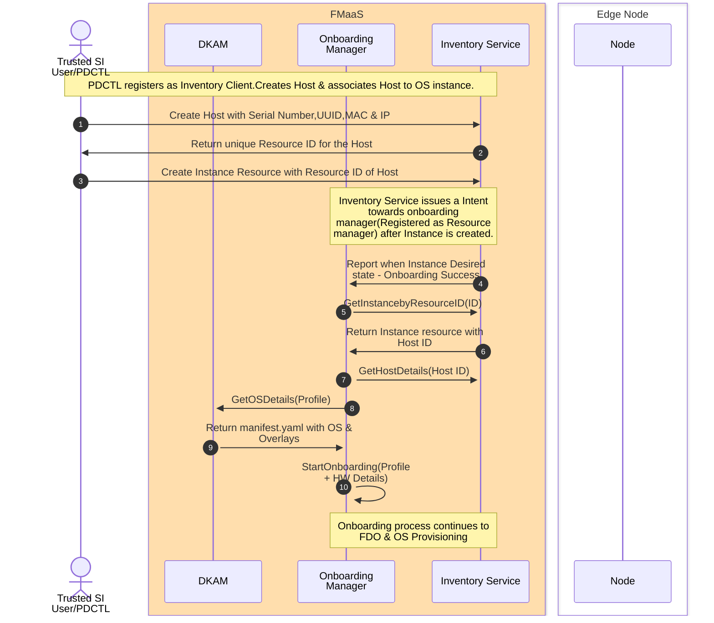

# Onboarding Manager Basic API

## Pre-requisite
1. GOLANG installed
2. Inventory manager Running
2. Dkam manager Running

## 1. Enabling GOLANG
```
export PATH=$PATH:/usr/local/go/bin
export PATH=$PATH:$(go env GOPATH)/bin
export GOPATH=$(go env GOPATH)
export MGR_HOST=localhost/IP
export ONBMGR_PORT=50054
```
### 1.1 Exporting Onboarding Parameters
```
export PD_IP=<pd_ip>
export DISK_PARTITION=/da/sda
export LOAD_BALANCER_IP=<load_balancer_ip>
export IMAGE_TYPE= prod_bkc
```
## 2. Run Onboarding manager 
```
go run main.go
```
### 2.1 Script to Run the Onboarding manager
```
    1. go to infrastructure.edge.iaas.platform\scripts\edge-iaas-platform\platform-director\onboarding\setup_scripts
    2. chmod +x onboardingsetup.sh
    3. ./onboardingsetup.sh <MGR_HOST:localhost/ip> <ONBMGR_PORT>

Note: This will start the server please use the another terminal to trigger pdctl command 
```
### 2.2 Manual running the Onboarding manager
``` 
    1. check all the Pre-requisite mentioned above
    2. Enabling GOLANG by exporting all variables 
    3. run main.go to start onboarding grpc server
        cd cmd/onboardingmgr/
        go run main.go
```
## 3. Build and Test for MS and BKC
```
How to run Onboaridng manager and trigger command from pdctl to start onboarding for the profile 

step 1) Navigate to the 'frameworks.edge.one-intel-edge.maestro-infra.secure-os-provision-onboarding-service` directory

step 3) check if onboarding manager and inventory service  is running 

```
### 3.1 Pdctl for End to End flow
````
    1) Navigate to frameworks.edge.one-intel-edge.maestro-infra.secure-os-provision-onboarding-service/cmd/pdctl/
    
    2) Create a Host resource 

    3) Create a Instance resource and associate it with host-id

    4) Once onboarding manager is running, it will reconcile with the Instance state and onboarding process will start.

    Examples:

        1.  pdctl host-res create --addr=localhost:50051 --insecure  --hostname=OS  --bmc-kind=BAREMETAL_CONTROLLER_KIND_PDU  --uuid=9fa8a788-f9f8-434a-8620-bbed2a12b0ad -s=10.49.76.113 -x=1c:69:7a:a8:12:af -c=INSTANCE_STATE_UNSPECIFIED --bmc-ip=10.223.87.65
    
        Note : The output of above command will generate a Host ID = host-1234ab

        2. pdctl instance-res create --addr=localhost:50051 --insecure --hostID=host-1234ab --kind=RESOURCE_KIND_INSTANCE -c=INSTANCE_STATE_INSTALLED 


Note: make sure your dkam is running to get the urls 
      Make sure your inventory service is running mentioned in step 5.1

````
## 4. Limitation and Caveats :
    Limitation :
        1) we can now only run one worklow for per profile either MS or BKC for multiple devices 
        2) let one profile onboarding should be finished then only trigger other profile command 

    Caveats :
		1) Ensure to set MGR_HOST and ONBMGR_PORT with desired IP address and port address to run this application hassle-free

		2) Ensure `startonboarding: true` in
		infrastructure.edge.iaas.platform/cmd/pdctl/commands/yaml/profile_sample.yaml to receive the start onboarding notification onboardingmgr

		4) Always ensure 'pdctl artifact get --addr=localhost:50052 --insecure' gives artifact output before issuing
		`pdctl profile create`

        5)Make sure to  add all the profile details in profile sample.yaml /cmd/pdctl


===============================================================================================================================
===============================================================================================================================

# 5. Test Node Operations : Create, Get, Update, and Delete nodes using gRPC client

## 5.1 Run the Maestro Inventory Service
````
git clone https://github.com/intel-innersource/frameworks.edge.one-intel-edge.maestro-infra.services.inventory

cd frameworks.edge.one-intel-edge.maestro-infra.services.inventory/

make go-build

make db-start

export PGUSER=admin
export PGHOST=localhost
export PGDATABASE=postgres
export PGPORT=5432
export PGPASSWORD=pass
export PGSSLMODE=disable

curl -sSf https://atlasgo.sh | sh

sudo cp -avr internal/ent/migrate/migrations /usr/share/

./build/miinv --policyBundle=./build/policy_bundle.tar.gz
````

## 5.2 Run the Onboarding service
```
git clone https://github.com/intel-innersource/frameworks.edge.one-intel-edge.maestro-infra.secure-os-provision-onboarding-service

go run cmd/onboardingmgr/main.go
```

## 5.3 Run the PDCTL command, client to the onboarding service
```
go run cmd/pdctl/main.go nodes add --addr=localhost:50052 --insecure --hw-id=123

go run cmd/pdctl/main.go nodes delete --addr=localhost:50052 --insecure --hw-id=123
```

### End to End flow with PDCTL



### Opens

1. Need to create OS resource as a first step & populate with the manifest from DKAM. 
2. While creating instance resource, OS resource also needs to be associated along with Host Resource.
3. Integration with CDN boots.
