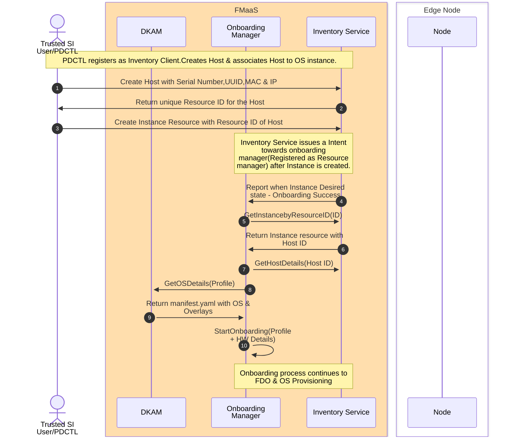

[6:05 PM] S, Devipriya
# Secure Onboarding and provisioning controller
 
This repo has the service controller module to do onboarding and provisioning

It will do the following things
 
1. OS image download as mentioned in the profile

2. FDO voucher extension

3. Tinker workflow management - DI and Final OS installation

4. Interfacing with inventory service to do profile management

5. Interfacing with DKAM service to get the curated software artifacts
 
## Setup
 
### Hareware topology Setup
 

 
Prequisite:
 
1. There are 3 servers with Internet connected acting as Ngnix server, Edge Infrastructure Manager server and Edge Node(DELL XR12) respectively.
 
2. The ngnix server and Edge Infrastructure Manager Server are manually installed ubuntu 22.04 server with proper network proxy setting. Ngnix server needs tool installation of openssl, docker, efitools, git, gcc, make, liblzma-dev.
 
Note: Nginx server is the temporary solution before CDN boot is available. Release service in AWS cloud is not available for 0.7.0. and will be ready in the future.
 
### Create Custom HTTPS supported NGINX server
 
1. Refer to this section [Server Certificates for HTTPS boot](https://github.com/intel-innersource/documentation.edge.one-edge.maestro/blob/762b2526abd36203f2ee5c20b45ccaea9ebb2140/content/docs/specs/secure-boot.md#server-certificates-for-htts-boot) for creating certificates. The file ```full_server.crt``` will be required in the next steps.
 
2. Clone the [repository](https://github.com/intel-sandbox/nginx/tree/main)
 
3. Go inside the repository and build and run the nginx container as per the [README](https://github.com/intel-sandbox/nginx/blob/main/README.md).

As seen in the docker run command example we are mounting two folders to the container, which are referred to in the next steps.
 
    ```bash

        -v ./certs:/etc/ssl/cert/ \

        -v ./data:/usr/share/nginx/html \

    ```
 
    ```certs``` : server certificates are present here

    ```data```  : files present here are hosted by the NGINX server
 
4. Once the NGINX container is up, replace the contents of ```certs/EB_web.crt``` with the contents of ```full_server.crt``` generated in the first step.
 
    ```bash

        cat full_server.crt > certs/EB_web.crt

    ```
 
### Modify auto.ipxe as per setup details
 
1. Inside ```data/auto.ipxe```, replace the placeholders with real values.
 
    ```bash

    set loadbalancer <LOADBALANCER> # IP address of Edge Infrastructure Manager Server

    set macaddress <MAC_ADDRESS>    # MAC address of Edge Node iPXE Boot NIC

    set nginx <NGINX_IP_ADDRESS>

    ```
 
3. Copy the ```vmlinuz``` and ```initramfs``` files generated in tink-stack inside the ```data``` folder.
 
4. Copy the signed ```ipxe.efi``` generated as per the [documentation](https://github.com/intel-innersource/documentation.edge.one-edge.maestro/blob/762b2526abd36203f2ee5c20b45ccaea9ebb2140/content/docs/specs/secure-boot.md#download-and-build-ipxe-image) inside the ```data``` folder.
 
### Upload certificate to BIOS
 
1. Refer the [documentation](https://github.com/intel-innersource/documentation.edge.one-edge.maestro/blob/762b2526abd36203f2ee5c20b45ccaea9ebb2140/content/docs/specs/secure-boot.md#bios-settings-in-idrac-gui) to upload the HTTP boot URL.<br>

The URL will be of the form ```https://<NGINX_HOST_IP_ADDRESS/ipxe.efi```<br>

The certificate file will be the ```full_server.crt``` file generated earlier.
 
### HTTP Boot
 
1. Boot to Tinkerbell interface using HTTP boot option.
 
### Deploy onboarding and provisioning components
 
> Note: This setup instructions are meant for On-prem deployment
 
1. Clone the code.
 
    ```bash

    git clone https://github.com/intel-innersource/frameworks.edge.one-intel-edge.maestro-infra.secure-os-provision-onboarding-service/releases/tag/v0.7.0-dev

    ```
 
2. configure config files.
 
    ~/frameworks.edge.one-intel-edge.maestro-infra.secure-os-provision-onboarding-service-0.7.0-dev/provisioning/config
 
    ~/frameworks.edge.one-intel-edge.maestro-infra.secure-os-provision-onboarding-service-0.7.0-dev/deployments/scripts/onboarding/config
 
3. Deploy the Tinkerbell services using tink-stack umbrella helm charts. If RKE2 cluster is not setup then below setup script will bring up RKE2 cluster and deploy the Tinkerbell components.
 
   ```bash

   cd provisioning

   chmod +x ./setup_tinkerbell_stack_with_intel_network.sh

   ./setup_tinkerbell_stack_with_intel_network.sh

   ```
 
   If RKE2 installation takes longer time, you may have a try to speed up RKE2 installation by the below instead.
 
   ```bash

   ver=v1.25.10+rke2r1

   vurl -sfL https://rancher-mirror.rancher.cn/rke2/install.sh | INSTALL_RKE2_MIRROR=cn INSTALL_RKE2_CHANNEL=$ver sh -

   ```
 
4. Build custom tinker actions docker images using script

Update config file which holds all the configuration details needed for the setup. Change parameters in config file `pub_inerface_name`, `pd_host_ip` and `load_balancer_ip` and proxy settings.
 
    ```bash

    cd deployments/scripts/onboarding

    vim config

    ```
 
    ```bash

    cd setup_scripts

    chmod + ./setup_actions.sh

    ./setup_actions.sh

    ```
 
Note: Please double check and make sure networkproxy is set properly on secure_hooks.sh/store_alpine.sh before running setup_action.sh.
 
5. Deploy the FDO services and provisioning service using helm chart
 
    ```bash

    cd deployments/scripts/onboarding/setup_scripts

    chmod + ./helm_setup_script.sh

    ./helm_setup_script.sh

    ```
 
## How to test
 
>Note: Install earthly

### Clone Repo

```

git clone https://github.com/intel-innersource/frameworks.edge.one-intel-edge.maestro-infra.secure-os-provision-onboarding-service.git
 
cd frameworks.edge.one-intel-edge.maestro-infra.secure-os-provision-onboarding-service
 
```

### Build PDCTL CLI tool
 
```

   cd cmd/pdctl/

   go install

```

## Run the Edge Orchestration Inventory Service in new window
 
```

git clone https://github.com/intel-innersource/frameworks.edge.one-intel-edge.maestro-infra.services.inventory

cd frameworks.edge.one-intel-edge.maestro-infra.services.inventory/

	@@ -138,7 +116,7 @@ curl -sSf https://atlasgo.sh | sh

sudo cp -avr internal/ent/migrate/migrations /usr/share/

./build/miinv --policyBundle=./build/policy_bundle.tar.gz
 
Please refer the README [https://github.com/intel-innersource/frameworks.edge.one-intel-edge.maestro-infra.services.inventory/blob/main/README.md]
 
```
 
### Run the DKAM Manager in a new Window
 
```

git clone https://github.com/intel-innersource/frameworks.edge.one-intel-edge.maestro-infra.dkam-service

cd cmd/dkammgr

go run main.go
 
```
 
### Exporting Onboarding Parameters

```

export PD_IP=<pd_ip>

export DISK_PARTITION=/dev/sda

export LOAD_BALANCER_IP=<load_balancer_ip>

export IMAGE_TYPE= prod_bkc

```
 
## Run Onboarding manager
 
pre-requisite refers to [documentation](https://github.com/intel-innersource/frameworks.edge.one-intel-edge.maestro-infra.secure-os-provision-onboarding-service/blob/main/cmd/onboardingmgr/README.md#pre-requisite)
 
```

cd cmd/onboardingmgr

go run main.go

```
 
## Run the Edge Orchestration Inventory Service in new window
 
    ```bash

    git clone https://github.com/intel-innersource/frameworks.edge.one-intel-edge.maestro-infra.services.inventory

    cd frameworks.edge.one-intel-edge.maestro-infra.services.inventory/

    #build tools installation

    make go-dependency

    curl -L -o opa https://openpolicyagent.org/downloads/v0.60.0/opa_linux_amd64_static

    chmod +x opa

    #build

    make go-build

    make db-start

    ```
 
Open one new ssh terminal.
 
    ```

    export PGUSER=admin

    export PGHOST=localhost

    export PGDATABASE=postgres

    export PGPORT=5432

    export PGPASSWORD=pass

    export PGSSLMODE=disable
 
    curl -sSf https://atlasgo.sh | sh
 
    sudo cp -avr internal/ent/migrate/migrations /usr/share/
 
    ./build/miinv --policyBundle=./build/policy_bundle.tar.gz

    ```
 
Refer to [documentation](https://github.com/intel-innersource/frameworks.edge.one-intel-edge.maestro-infra.secure-os-provision-onboarding-service/blob/v0.7.0-dev/cmd/onboardingmgr/README.md#51-run-the-maestro-inventory-service)
 
## Run DKAM
 
    ```

    # enable GOLANG

    export PATH=$PATH:/usr/local/go/bin

    export PATH=$PATH:$(go env GOPATH)/bin

    export GOPATH=$(go env GOPATH)
 
    # Run DKAM Manager

    cd ./cmd/dkammgr

    go run ./main.go

    #Open 2nd terminal and execute following:

    cd ./internal/dkammgr/test/client

    go run ./main.go

    ```

Refer to [documentation](https://github.com/intel-innersource/frameworks.edge.one-intel-edge.maestro-infra.dkam-service/tree/0.7.0-Dev/cmd/dkammgr)
 
## PDCTL based E-E onboarding flow
 
### 1) Create a Host resource
 
```

pdctl host-res create --addr=<inventory_service>:<port> --insecure --hostname=<name> --bmc-kind=BAREMETAL_CONTROLLER_KIND_PDU --uuid=<uuid> --sut-ip=<sut-ip> --pxe-mac=<mac> -c=INSTANCE_STATE_UNSPECIFIED --bmc-ip=<bmc_ip>
 
```
 
### 2) Create a OS resource
 
```

pdctl os-res create --addr=<inventory_service>:<port> --profileName=<profile-name>  --repo_url=<repo_url> --insecure
 
```
 
### 3) Get the Host ID and OS ID to associate with Instance
 
```

pdctl host-res get --addr=<inventory_service>:<port> --insecure  
 
pdctl os-res get --addr=<inventory_service>:<port> --insecure
 
Note: The Output of the above commands will give you Host Id and OS Id.
 
```
 
### 4) Create a Instance resource and associate it with host-id and os-id
 
```

pdctl instance-res create --addr=<inventory_service>:<port> --insecure --hostID=<host-id from above output> --kind=RESOURCE_KIND_INSTANCE  --osID=<os-id from above output> 

```
 
3) Once onboarding manager is running, it will reconcile with the Instance state and onboarding process will start.
 
6. Choose boot option to boot from UEFI HTTP
 
7. After this on the node side operations will happen without intervention. Monitor the logs of onboarding manager service and tinker boots log.
 
### End to End flow with PDCTL
 

 
### Next Steps
 
1. Need to create OS resource as a first step & populate with the manifest from DKAM. 

2. While creating instance resource, OS resource also needs to be associated along with Host Resource.

3. Integration with CDN boots.

4. Need to test by deploying onboarding manager & inventory service.
 
## Troubleshoot
 
### Run Inventory Service
 
When clone https://github.com/intel-innersource/frameworks.edge.one-intel-edge.maestro-infra.services.inventory
 
If the latest code doesn't work well, you can follow the below steps to fix.
 
1) choose the right commit ID.
 
    ```

    cd frameworks.edge.one-intel-edge.maestro-infra.services.inventory

    git checkout 0aeaedf

    vim frameworks.edge.one-intel-edge.maestro-infra.services.inventory/internal/utils/migrate/util.go

    ```
 
line#40  change
 
      "--dir", "file://" + migrationsDir,
 
to
 
    "--dir", "file://" + "internal/ent/migrate/migrations",
 
then proceed with building process.

    ```

    make go-build

    make db-start

    ```

### Command to run unit test cases for onboarding package from onboardingmgr
Path - frameworks.edge.one-intel-edge.maestro-infra.secure-os-provision-onboarding-service/internal/onboardingmgr/onboarding

Command - go test

Test cases List : GenerateGatewayFromBaseIP, CreateDeviceInfoListNAzureEnv, CreateAzureEnvFile, ParseNGetBkcUrl, MakeGETRequestWithRetry, DeviceOnboardingManagerNzt, DeviceOnboardingManager, StartOnboarding

### Command to run unit test cases for onbworkflowclient package from onboardingmgr
Path - frameworks.edge.one-intel-edge.maestro-infra.secure-os-provision-onboarding-service/internal/onboardingmgr/onbworkflowclient

Command - go test

Test cases List : File# Secure Onboarding and provisioning controller

This repo has the service controller module to do onboarding and provisioning
It will do the following things

1. OS image download as mentioned in the profile
2. FDO voucher extension
3. Tinker workflow management - DI and Final OS installation
4. Interfacing with inventory service to do profile management
5. Interfacing with DKAM service to get the curated software artifacts

## Setup

### Create Custom HTTPS supported NGINX server

1. Refer to this section [Server Certificates for HTTPS boot](https://github.com/intel-innersource/documentation.edge.one-edge.maestro/blob/762b2526abd36203f2ee5c20b45ccaea9ebb2140/content/docs/specs/secure-boot.md#server-certificates-for-htts-boot) for creating certificates. The file ```full_server.crt``` will be required in the next steps.

2. Clone the [repository](https://github.com/intel-sandbox/nginx/tree/main)

3. Go inside the repository and build and run the nginx container as per the [README](https://github.com/intel-sandbox/nginx/blob/main/README.md).
As seen in the docker run command example we are mounting two folders to the container, which are referred to in the next steps.

    ```bash
        -v ./certs:/etc/ssl/cert/ \
        -v ./data:/usr/share/nginx/html \
    ```

    ```certs``` : server certificates are present here
    ```data```  : files present here are hosted by the NGINX server

4. Once the NGINX container is up, replace the contents of ```certs/EB_web.crt``` with the contents of ```full_server.crt``` generated in the first step.

    ```bash
        cat full_server.crt > certs/EB_web.crt
    ```

### Modify auto.ipxe as per setup details

1. Inside ```data/auto.ipxe```, replace the placeholders with real values.

    ```bash
        set loadbalancer <LOADBALANCER>
        set macaddress <MAC_ADDRESS>
        set nginx <NGINX_IP_ADDRESS>
    ```

2. Copy the ```vmlinuz``` and ```initramfs``` files generated in tink-stack inside the ```data``` folder.

3. Copy the signed ```ipxe.efi``` generated as per the [documentation](https://github.com/intel-innersource/documentation.edge.one-edge.maestro/blob/762b2526abd36203f2ee5c20b45ccaea9ebb2140/content/docs/specs/secure-boot.md#download-and-build-ipxe-image) inside the ```data``` folder.

### Upload certificate to BIOS

1. Refer the [documentation](https://github.com/intel-innersource/documentation.edge.one-edge.maestro/blob/762b2526abd36203f2ee5c20b45ccaea9ebb2140/content/docs/specs/secure-boot.md#bios-settings-in-idrac-gui) to upload the HTTP boot URL.<br>
The URL will be of the form ```https://<NGINX_HOST_IP_ADDRESS/ipxe.efi```<br>
The certificate file will be the ```full_server.crt``` file generated earlier.

### HTTP Boot

1. Boot to Tinkerbell interface using HTTP boot option.

### Deploy onboarding and provisioning components

> Note: This setup instructions are meant for On-prem deployment

1. Deploy the Tinkerbell services using tink-stack umbrella helm charts. If RKE2 cluster is not setup then below setup script will bring up RKE2 cluster and deploy the Tinkerbell components.

   ```bash
   cd provisioning
   chmod +x ./setup_tinkerbell_stack_with_intel_network.sh
   ./setup_tinkerbell_stack_with_intel_network.sh
   ```

2. Build custom tinker actions docker images using script
Update config file which holds all the configuration details needed for the setup. Change parameters in config file `pub_inerface_name`, `pd_host_ip` and `load_balancer_ip` and proxy settings.

    ```bash
    cd deployments/scripts/onboarding
    vim config
    ```

    ```bash
    cd setup_scripts
    chmod + ./setup_actions.sh
    ./setup_actions.sh
    ```

3. Deploy the FDO services and provisioning service using helm chart

    ```bash
    cd deployments/scripts/onboarding/setup_scripts
    chmod + ./helm_setup_script.sh
    ./helm_setup_script.sh
    ```

## How to test

>Note: Install earthly
### Clone Repo
```
git clone https://github.com/intel-innersource/frameworks.edge.one-intel-edge.maestro-infra.secure-os-provision-onboarding-service.git

cd frameworks.edge.one-intel-edge.maestro-infra.secure-os-provision-onboarding-service

```
### Build PDCTL CLI tool

```
   cd cmd/pdctl/
   go install
```

### Exporting Onboarding Parameters
```
export PD_IP=<pd_ip>
export DISK_PARTITION=/da/sda
export LOAD_BALANCER_IP=<load_balancer_ip>
export IMAGE_TYPE= prod_bkc
```

## Run Onboarding manager

```
cd cmd/onboardingmgr
go run main.go
```

## Run the Edge Orchestration Inventory Service in new window

```
git clone https://github.com/intel-innersource/frameworks.edge.one-intel-edge.maestro-infra.services.inventory
cd frameworks.edge.one-intel-edge.maestro-infra.services.inventory/
	@@ -138,7 +116,7 @@ curl -sSf https://atlasgo.sh | sh
sudo cp -avr internal/ent/migrate/migrations /usr/share/
./build/miinv --policyBundle=./build/policy_bundle.tar.gz

```

## PDCTL based E-E onboarding flow

### 1) Create a Host resource 

```
pdctl host-res create --addr=<inventory_service>:<port> --insecure --hostname=<name> --bmc-kind=BAREMETAL_CONTROLLER_KIND_PDU --uuid=<uuid> --sut-ip=<sut-ip> --pxe-mac=<mac> -c=INSTANCE_STATE_UNSPECIFIED --bmc-ip=<bmc_ip>

Note : The output of above command will give Host ID = <>
```

### 2) Create a Instance resource and associate it with host-id

```
pdctl instance-res create --addr=<inventory_service>:<port> --insecure --hostID=<host-id from above output> --kind=RESOURCE_KIND_INSTANCE -c=INSTANCE_STATE_INSTALLED
```

3) Once onboarding manager is running, it will reconcile with the Instance state and onboarding process will start.

6. Choose boot option to boot from UEFI HTTP

7. After this on the node side operations will happen without intervention. Monitor the logs of onboarding manager service and tinker boots log.

### End to End flow with PDCTL


### Next Steps

1. Need to create OS resource as a first step & populate with the manifest from DKAM. 
2. While creating instance resource, OS resource also needs to be associated along with Host Resource.
3. Integration with CDN boots.
4. Need to test by deploying onboarding manager & inventory service.

### Metrics
For the Southbound API, grpc metrics are made available, when switched on and the port specified. They are typicaly scraped by promethus and will be present in strandard observavbilitiy console.
For test or investigation purposes, turn on the metrics at a suitable port, and forward the metrics to localhost and the query the inbuilt metrics server.

```nohup kubectl port-forward service/mi-onboarding-manager -n maestro-iaas-system 8081:8081 --address 0.0.0.0  &
curl -s 127.0.0.1:8081/metrics   | grep grpc_server_msg.*CreateNodes
```

### Command to run unit test cases for onboarding package from onboardingmgr
Path - frameworks.edge.one-intel-edge.maestro-infra.secure-os-provision-onboarding-service/internal/onboardingmgr/onboarding

Command - go test

Test cases List : GenerateGatewayFromBaseIP, CreateDeviceInfoListNAzureEnv, CreateAzureEnvFile, ParseNGetBkcUrl, MakeGETRequestWithRetry, DeviceOnboardingManagerNzt, DeviceOnboardingManager, StartOnboarding

### Command to run unit test cases for onbworkflowclient package from onboardingmgr
Path - frameworks.edge.one-intel-edge.maestro-infra.secure-os-provision-onboarding-service/internal/onboardingmgr/onbworkflowclient

Command - go test

Test cases List : FileExists, CreateDynamicClie
GenerateStringDataFromYAML, UnmarshalYAMLContent, CaSlculateRootF, ApiCalls, GenerateUnstructuredFromYAML, ImageDownload_Bkc, ImageDownload, ReadingYamlNCreatingResourse, DeleteCustomResource, DiWorkflowCreation, VoucherScript, DeleteWorkflow, ProdWorkflowCreation